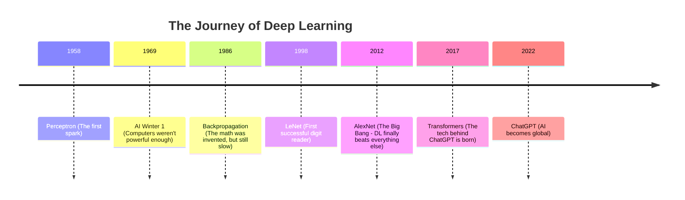

# Session 1: Introduction to Deep Learning — Detailed Slide Notes

*Welcome! These notes are designed for someone with **zero prior knowledge**. We will break down every slide from Professor Magda Gregorová's first lecture into simple, digestible pieces. Think of this as your "plain English" translator for the world of AI.*

---

## 🏗️ The Zero-Knowledge Glossary
Before we start, here are three terms you'll see a lot:
1.  **Algorithm**: A fancy word for a "recipe." It’s a set of instructions a computer follows.
2.  **Dataset**: A giant folder of examples (like 60,000 photos) used to teach the computer.
3.  **Model**: The "brain" that result after the computer has finished learning from the data.

---

## Slide 1 & 2: The Hook
> *"Pieces of code that do stuff and nobody understands how."*

**The Big Idea:** Usually, humans write every line of code (if A happens, do B). In Deep Learning, we build a structure, show it millions of examples, and it *figures out the rules itself*. It becomes a "Black Box"—we know it works, but it's hard to see exactly *how* it's thinking.

---

## Slide 3: The Task (Image Classification)
**Concept: CIFAR-10**
Imagine you have 60,000 tiny, blurry photos. Each photo is only 32x32 pixels (that's very small!). 
*   **The Goal:** Tell the computer to look at the "raw pixels" (just numbers representing colors) and guess if it's a **Dog**, a **Frog**, or a **Truck**.
*   **Why it's hard:** Computers don't "see" a dog. They see a grid of numbers. If the dog is brown, the numbers are different than if the dog is white. Deep Learning must find the common "pattern" of "dog-ness" regardless of color or angle.

---

## Slide 4 & 5: Why are we here?
**The "Easy" Way:** Today, you can just ask an AI (like ChatGPT) to write the code for you. It's "easy" to make it work.
**The "Real" Way:** This course isn't about just *running* code. It’s about understanding **WHY** it works. 
> [!TIP]
> Just like you can drive a car without knowing how an engine works, you *can* use AI. But if the car breaks down, or you want to build a faster car, you need to understand the engine. This course is about the "engine" of Deep Learning.

---

## Slide 7: What is Deep Learning? (The Hierarchy)
This is the "Russian Nesting Doll" of technology. 

1.  **AI (Artificial Intelligence):** The broadest category. Anything that acts "smart" (even a simple calculator).
2.  **ML (Machine Learning):** A subset where the computer learns from data instead of being told exactly what to do.
3.  **DL (Deep Learning):** A specific type of ML that uses "Neural Networks" (layers of math inspired by the brain). This is what made AI explode in power recently.
4.  **GenAI (Generative AI):** The newest tip of the spear. This is AI that *creates* new things (like writing a story or drawing a picture).

---

## Slide 8: A Brief History (The Timeline)
AI didn't happen overnight. It had "Winters" where everyone stopped believing in it because it wasn't working.

---

## Slide 9: Why Now? (The Four Forces)
Why did it take 40 years for the math to finally work? Four things had to happen at the same time:

1.  **Data (Fuel):** We finally had the Internet to provide millions of photos and texts.
2.  **Compute (Engine):** We started using **GPUs** (Graphics cards) which are much faster at this specific math.
3.  **Algorithms (Design):** We found better "recipes" for the math so it didn't crash.
4.  **Community (Open Road):** Scientists shared their work for free (PyTorch, TensorFlow).

---

## Slide 10: Data - The Scale Revolution
This slide shows that datasets went from **70,000** images to **5,000,000,000** (5 Billion!). 
*   **The Lesson:** Deep Learning is "hungry." The more data you feed it, the smarter it gets. Traditional software doesn't work like this.

---

## Slide 11: Compute & GPUs
**Parallel vs. Sequential**
*   **CPU:** Like a genius professor who does one hard problem at a time.
*   **GPU:** Like 10,000 students who all do one tiny addition problem at the exact same time.
Deep Learning is just millions of tiny additions. So, the "army of students" (GPU) wins every time.

---

## Slide 12 & 13: What can it do?
Deep Learning is everywhere now:
*   **Vision:** Self-driving cars seeing pedestrians.
*   **Language:** Google Translate and ChatGPT.
*   **Medicine:** Finding tumors in X-rays better than humans.
*   **Science:** Predicting how proteins fold (AlphaFold).

---

## Slide 14 - 18: Course Logistics
*   **The Roadmap:** You will start with the basics (MLPs), move to "Eyes" (CNNs for images), then "Memory" (RNNs/Transformers for text), and finally "Creativity" (Generative models).
*   **Grading:** 
    *   30% Mid-term (May)
    *   70% Final Project (July)
> [!WARNING]
> You must pass **both** parts to pass the course. No late submissions!

---

## Slide 19: What We Value (The Student Manifesto)
Professor Gregorová wants you to follow these rules:
1.  **Understand every line of code.** Don't just copy-paste!
2.  **Explain WHY, not just WHAT.** 
3.  **Clear thinking > Accuracy.** A model that is 99% accurate but you don't know why is useless.
4.  **Don't prompt better—think deeper.** 

---

## Slide 20: Homework
Before Wednesday, you need to set up your "Workshop":
*   **Python:** The language we use.
*   **PyTorch:** The main tool (library) for Deep Learning.
*   **VSCode/PyCharm:** Where you will write your code.

---
*Created with ❤️ for your Deep Learning journey.*
