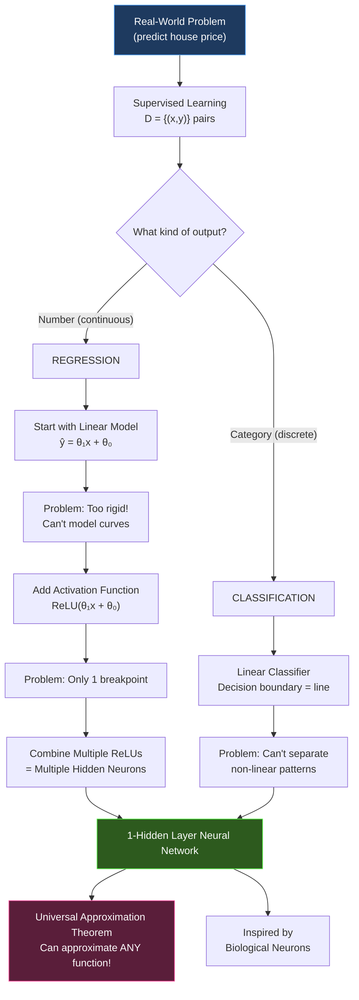

# The Unabridged Study Guide: Deep Learning
**Module 2: Shallow Neural Networks (Session 2)**

*This is the deeply expanded, unabridged textbook for Session 2 of Professor Magda Gregorová's Deep Learning course. Every concept is explained from absolute zero, with rich analogies, visualizations, and conceptual depth at a Master of Science level. We pick up right where Session 1 left off.*

---

## 🔗 Quick Recap: Where Session 1 Left Us

In Session 1, we learned:
- **AI > ML > DL > GenAI** — the Russian Nesting Dolls hierarchy
- Deep Learning uses **Neural Networks** that *invent their own features* (unlike traditional ML where humans hand-craft features)
- The 2012 explosion happened because of **Data + GPUs + Better Algorithms + Open Community**
- GPUs = 10,000 third-graders doing simple math simultaneously (parallel computation)
- The course philosophy: **Understand WHY, not just WHAT**

**Now, in Session 2, we answer the question Session 1 left hanging:**

> *"Okay, so Neural Networks are powerful... but what IS a Neural Network, mathematically? How does it actually work under the hood?"*

Let's build one from scratch, piece by piece.

---

## Part 1: Supervised Learning — The Ground Rules

### 1.1 Why Do We Need Machine Learning At All? (Slide 3)

Before we jump into neural networks, Professor Gregorová asks a fundamental question: **Why can't we just write normal software?**

Think about it. You're a programmer. You want to write code that recognizes whether a photo contains a cat or a dog. In traditional software, you'd try:

```
if image_has_pointy_ears AND image_has_whiskers:
    return "cat"
else:
    return "dog"
```

**The problem?** This breaks instantly because:
- 🔄 **Too many variations:** Cats come in 100+ breeds, different angles, lighting conditions
- 🌊 **Constantly changing conditions:** Is the cat underwater? In the dark? Upside down?
- 🧩 **Too complex to understand fully:** How do you even *define* "pointy ears" in terms of pixel numbers?
- 💰 **Too expensive to compute:** You'd need billions of if-else rules

**Machine Learning flips the script.** Instead of you writing the rules, you give the computer *examples* and let it figure out the rules itself. That's the fundamental shift.

> **Analogy — The Chef vs. The Taste Tester:**
> - **Traditional Programming** = You are the chef. You write the exact recipe (rules) step by step. If someone wants a slightly different dish, you must rewrite the entire recipe.
> - **Machine Learning** = You're a taste tester. You eat 10,000 dishes, and your brain *automatically* learns to distinguish Italian from Chinese food without anyone teaching you explicit rules. You "just know."

---

### 1.2 The Setup: What IS Supervised Learning? (Slide 4)

This is the **single most important slide** of the entire lecture. Every neural network you'll ever build in this course follows this exact setup:

#### The Three Ingredients

| Symbol | What It Means | Analogy |
|--------|---------------|---------|
| **x** | The **input** (what you feed in) | The exam question |
| **y** | The **output** (the correct answer) | The answer key |
| **f*** | The **true relationship** between x and y | The "laws of the universe" that connect questions to answers |

#### The Big Picture

Imagine there's a **secret, perfect formula** hidden in the universe. This formula, called **f\*** (f-star), can perfectly convert any input **x** into the correct output **y**.

**Example:** If x = "a photo of a cat", then f\*(x) = "cat". Always. Perfectly.

**The cruel twist:** We **never get to see f\***. Ever. It's like knowing that there's a perfect recipe for the world's best chocolate cake, but it's locked in a vault that nobody can open.

#### What We DO Have

We have a **dataset** — a collection of input-output pairs that someone already labeled:

$$D = \{(x^{(1)}, y^{(1)}), (x^{(2)}, y^{(2)}), ..., (x^{(N)}, y^{(N)})\}$$

In plain English: "Here are N examples where we already know the answer."

- Example 1: (photo_of_cat, "cat")
- Example 2: (photo_of_dog, "dog")
- Example 3: (photo_of_truck, "truck")
- ... 60,000 more of these

#### The Goal

Build our OWN formula **f_θ** (f-theta) that is a damn good *approximation* of the secret formula f\*.

$$f_θ ≈ f^*$$

> **Analogy — The Forger:**
> Imagine the Mona Lisa (f\*) is locked behind bulletproof glass. You've never touched it. But you have 60,000 photos of it from different angles (your dataset D). Your job is to paint a *copy* (f_θ) that is SO close to the original that nobody can tell the difference.
>
> - **θ (theta)** = the specific brush strokes, colors, and techniques you choose.
> - **Training** = the process of adjusting your brush strokes until your copy looks perfect.
> - **The test** = showing your copy to someone who has NEVER seen the original, and they assume it's real. (This is called **generalization** — working on *unseen* inputs.)

#### The Notation Cheat Sheet

The slide shows: `f_θ(x) = f(x; θ) = ŷ`

All three of these mean **the exact same thing:**
- f_θ(x) → "Our model, with parameters θ, applied to input x"
- f(x; θ) → "A function of x, configured by θ"
- ŷ (y-hat) → "Our **prediction**" (the hat ^ means "estimated/predicted")

> [!IMPORTANT]
> **θ (theta)** is the STAR of the entire course. These are the **knobs and dials** that the neural network adjusts during training. When we say "training a model," we literally mean "finding the best values of θ."

---

### 1.3 The Two Flavors of Supervised Learning (Slide 5)

Supervised learning has two main "flavors," depending on what kind of answer you want:

#### Flavor 1: Classification (Sorting into Buckets)

- **Output type:** A **label/category** (discrete, like "cat" or "dog")
- **Goal:** Draw a **boundary line** that separates different categories
- **Example:** "Is this email spam or not spam?"

Think of it as a bouncer at a club. The bouncer looks at you (input x) and makes a binary decision: you're IN (y=1) or you're OUT (y=0). The bouncer's "decision boundary" is whatever invisible rule they use (dress code, guest list, etc.)

```
 x2 ↑
    |  ● ● ●         ← y = 1 (cats)
    |    ● ●
    | --------        ← Decision boundary (the line the model learns)
    |  ○ ○ ○
    |    ○ ○           ← y = 0 (dogs)
    +----------→ x1
```

#### Flavor 2: Regression (Predicting a Number)

- **Output type:** A **continuous number** (like 72.5 kg, or $34,000)
- **Goal:** Draw a **line (or curve)** that fits through data points
- **Example:** "Given the size of a house, predict its price."

Think of it as a weather forecaster. They don't say "hot or cold" (that would be classification). They say "it will be **23.7°C**" — a specific number on a continuous scale.

```
  y ↑      ●
    |    ●    ●
    |  ●  --------    ← Regression line (best fit)
    | ●   ●
    |●
    +----------→ x
```

> [!TIP]
> **How to tell them apart:**
> - If the answer is a **category** (cat/dog, spam/not-spam, sick/healthy) → **Classification**
> - If the answer is a **number on a sliding scale** (price, temperature, weight) → **Regression**
> 
> Session 2 starts with **regression** because it's simpler to visualize and understand.

---

## Part 2: Linear Regression — The Baby Step

### 2.1 The Simplest Possible Model (Slide 6)

Now we need to actually BUILD f_θ. What's the simplest possible mathematical formula we could use?

**A straight line.**

$$\hat{y} = f_θ(x) = θ_1 \cdot x + θ_0$$

If you've ever taken any math class, you've seen this before. It's the equation of a straight line:

| Symbol | What It Is | Alternative Name |
|--------|-----------|-----------------|
| **θ₁** (theta-one) | The **slope** — how steep the line is | Weight |
| **θ₀** (theta-zero) | The **y-intercept** — where the line crosses the y-axis | Bias |
| **x** | The input | Feature |
| **ŷ** | The predicted output | Prediction |

> **Analogy — The Salary Predictor:**
> Suppose you want to predict someone's salary (ŷ) based on their years of experience (x).
> - θ₁ = 5,000 means "for every extra year of experience, salary goes up by $5,000"
> - θ₀ = 30,000 means "a person with 0 years experience earns $30,000 as a base"
> - So: ŷ = 5000 × x + 30000
> - Someone with 5 years experience: ŷ = 5000 × 5 + 30000 = **$55,000**

#### The Diagram — Your First "Neuron"

The slide shows this tiny diagram:

```
    1 ──(θ₀)──┐
              ├──► Σ ──► ŷ
    x ──(θ₁)──┘
```

**Reading this diagram:**
1. There are two inputs: the number `1` (a constant, always there) and `x` (your actual data)
2. Each input gets multiplied by its corresponding θ
3. The **Σ** (sigma, the Greek S) means "**sum everything up**"
4. Result: ŷ = θ₀ × 1 + θ₁ × x = θ₀ + θ₁x

This tiny diagram IS the simplest possible neural network. Just one "neuron" doing a weighted sum.

#### The Problem: Real Life Isn't a Straight Line

Here's the critical limitation: **almost nothing in the real world follows a straight line.**

- The relationship between "hours studied" and "exam score" flattens out eventually (studying 100 hours won't give you 200%)
- House prices don't increase linearly forever
- Drug dosage effectiveness follows an S-curve

A straight line is too rigid. We need something that can **bend.**

The slide asks: should we use sin, log, √, exp? The professor says **no** — those are too specific. We need something more general and flexible.

---

## Part 3: Nonlinear Regression — Making the Line Bend

### 3.1 The Activation Function (Slide 7)

Here's the elegant trick that makes neural networks possible:

**Take the linear formula, and wrap it in a nonlinear function `a()`:**

$$\hat{y} = f_θ(x) = a(θ_1 \cdot x + θ_0)$$

The function `a()` is called an **activation function**. It's a simple mathematical operation that *bends* the straight line.

```
    1 ──(θ₀)──┐
              ├──► Σ ──► [a] ──► ŷ
    x ──(θ₁)──┘
```

The only difference from before: we added the box `[a]` after the sum. This box takes the straight-line output and **transforms** it into something nonlinear.

> **Analogy — The Cookie Cutter:**
> - **Without activation function:** You push dough through a straight tube. Every cookie comes out as a boring stick.
> - **With activation function:** You add a **mold** at the end of the tube. Now dough gets reshaped into stars, hearts, or circles. Same dough (input), but the mold (activation function) transforms the shape (output).

The professor then introduces a brilliant idea: **piecewise linear functions**. Instead of smooth curves, what if we made a function that is just multiple straight-line *segments* joined together? Like a folded piece of paper instead of a smooth curve?

```
  y ↑
    |         /──── ← Segment 3
    |        /
    |  _____/       ← Segment 2 (flat)
    | /
    |/              ← Segment 1
    +──────────→ x
```

This is exactly what ReLU does!

---

### 3.2 ReLU — The Heart of Modern Deep Learning (Slide 8)

**ReLU** stands for **Rectified Linear Unit**. It is, without exaggeration, one of the most important inventions in all of Deep Learning. And it's embarrassingly simple:

$$ReLU(x) = max(0, x) = \begin{cases} x & \text{if } x > 0 \\ 0 & \text{if } x ≤ 0 \end{cases}$$

**In plain English:** "If the number is positive, keep it. If the number is negative, make it zero."

That's it. That's the whole thing.

```
  y ↑
    |          /
    |         /
    |        /
    |       /
    |──────/ ─────→ x
    |     0
    
    (Everything to the left of 0 is squashed flat at y=0)
    (Everything to the right is just the identity: y=x)
```

> **Analogy — The Water Faucet:**
> Imagine a water faucet where:
> - If you push the handle **forward** (positive input) → water flows out at exactly the rate you push
> - If you push the handle **backward** (negative input) → nothing happens, the faucet stays closed
>
> ReLU is that faucet. It only lets "positive signal" through and blocks "negative signal."

#### Why Is ReLU So Popular?

1. **Absurdly simple to compute:** It's literally just "is this number > 0?" — even a third-grader can do it (remember our GPU analogy!)
2. **It creates bends:** When you apply ReLU to a linear function, you get a "hinge" — the line goes flat on one side and stays straight on the other
3. **It works amazingly in practice:** Despite (or because of) its simplicity, it outperforms more complex functions

#### What Happens When ReLU Wraps Our Linear Function?

$$\hat{y} = ReLU(θ_1 \cdot x + θ_0)$$

The straight line θ₁x + θ₀ normally extends from -∞ to +∞. But ReLU **chops off** everything below zero:

```
  y ↑
    |          /
    |         /      ← Active region (ReLU passes through)
    |        /
    |───────●        ← The "breakpoint" at x = -θ₀/θ₁
    |                ← Inactive region (ReLU squashes to 0)
    +──────────→ x
```

**The breakpoint** (where the bend happens) is at x = -θ₀/θ₁. This matters because:
- By changing θ₀ and θ₁, you can **slide the breakpoint** left or right along the x-axis
- And **change the steepness** of the active part

But one breakpoint isn't enough to model complex shapes. You can only make an "L" shape. Real data needs curves with MANY bends. The solution? **Combine multiple ReLUs!**

---

## Part 4: Combining ReLUs — Building the Neural Network

### 4.1 Two ReLUs = Two Breakpoints (Slide 9)

Here's where the magic starts. Instead of one ReLU, we use **multiple**, and then add their results together:

$$\hat{y} = θ_0 + θ_1 \cdot h_1 + θ_2 \cdot h_2$$

where:
- $h_1 = ReLU(θ_{11} \cdot x + θ_{10})$ ← First ReLU unit
- $h_2 = ReLU(θ_{21} \cdot x + θ_{20})$ ← Second ReLU unit

**In plain English:**

1. Take the input x
2. Feed it into ReLU #1 (with its own θ values) → get h₁
3. Feed it into ReLU #2 (with different θ values) → get h₂
4. Combine h₁ and h₂ with a weighted sum + a bias → get the final prediction ŷ

Each ReLU creates **one breakpoint**. Two ReLUs = two breakpoints. The combined function now has **two bends**:

```
  y ↑
    |     /\
    |    /  \        ← The combination of two ReLUs creates a "tent"
    |   /    \          or "zigzag" shape!
    |  /      ──── 
    | /
    +──────────→ x
      b₁    b₂
    (breakpoint 1)  (breakpoint 2)
```

> **Analogy — Lego Bricks:**
> Each ReLU is like a single Lego brick with a specific shape (an "L" bend). Individually, each brick isn't very impressive. But when you **snap multiple bricks together** (weighted sum), you can build increasingly complex shapes. Two bricks = a simple tent. Three bricks = a zigzag. A hundred bricks = something that looks almost like a smooth curve!

### 4.2 Three ReLUs = Three Breakpoints (Slide 9 continued)

Add a third ReLU:

$$\hat{y} = θ_0 + θ_1 h_1 + θ_2 h_2 + θ_3 h_3$$

Now you have **three** bends, and your function can form even more complex shapes.

**The general formula with k ReLUs:**

$$\hat{y} = f_θ(x) = θ_0 + \sum_{j=1}^{k} θ_j \cdot ReLU(θ_{j1} \cdot x + θ_{j0})$$

> [!IMPORTANT]
> **The KEY insight of this entire slide:**
> More ReLUs → More breakpoints → More expressive function → Can approximate more complex real-world patterns
>
> This is exactly like increasing the resolution of a digital image. Each ReLU is a "pixel." With 10 pixels you get a blocky mess. With 1,000,000 pixels you get a photograph. Same principle.

---

### 4.3 Drawing the Network (Slide 10)

Now we go from math to **pictures**. This is where the term "Neural Network" starts to make visual sense.

The slide shows **four levels of abstraction** for the exact same math. All four diagrams below represent the IDENTICAL function:

$$\hat{y} = θ_0 + θ_1 \cdot ReLU(θ_{11}x + θ_{10}) + θ_2 \cdot ReLU(θ_{21}x + θ_{20})$$

#### Level 1: Full Detail

```
                    ┌───────────────────┐
     1 ──(θ₁₀)──►  │                   │
                    │  h₁ = ReLU(sum)   ├──(θ₁)──┐
     x ──(θ₁₁)──►  │                   │         │
                    └───────────────────┘         │
                                                  ├──► Σ ──► ŷ
                    ┌───────────────────┐         │
     1 ──(θ₂₀)──►  │                   │         │
                    │  h₂ = ReLU(sum)   ├──(θ₂)──┘
     x ──(θ₂₁)──►  │                   │   1 ──(θ₀)──┘
                    └───────────────────┘
```

Every arrow has a **weight** (θ) label. Every bias is shown as a "1" input.

#### Level 4: The Simplified "Neural Network" Diagram

```
                ┌──── h₁ ────┐
     x ────────►│            ├────► ŷ
                └──── h₂ ────┘
     
     INPUT      HIDDEN        OUTPUT
     LAYER      LAYER         LAYER
```

This is the iconic "neural network" picture you see everywhere! Each circle (node) is called a **neuron**. The lines connecting them represent the weights (θ values).

> **Analogy — The Assembly Line:**
> Think of a car factory:
> - **Input Layer (x):** Raw materials arrive (steel, rubber, glass)
> - **Hidden Layer (h₁, h₂):** Each worker (neuron) takes the raw material, processes it their own way (ReLU), and produces an intermediate component (h value)
> - **Output Layer (ŷ):** A final assembler takes all the components, weighs their importance, and produces the finished car (prediction)
>
> The "weights" (θ) on the arrows are like **quality ratings** — they say "I trust Worker 1's component twice as much as Worker 2's." The network learns these trust ratings during training.

---

## Part 5: The 1-Hidden Layer Neural Network (Slide 11)

### 5.1 Scaling Up: More Neurons

Now let's generalize. Instead of just 2 hidden neurons, we use **k** neurons:

$$\hat{y} = θ_0 + \sum_{j=1}^{k} θ_j \cdot h_j$$
$$h_j = ReLU(θ_{j1} \cdot x + θ_{j0})$$

```
                ┌──── h₁ ────┐
                │             │
     x ────────►├──── h₂ ────┤────► ŷ
                │     ⋮       │
                └──── hₖ ────┘
     
     INPUT      HIDDEN          OUTPUT
     (1 neuron) (k neurons)     (1 neuron)
```

The more neurons (k), the more breakpoints, the more complex a function you can approximate.

### 5.2 Scaling Up: More Inputs

Real-world problems don't have just one input. A house price depends on size, location, age, number of rooms, etc. So we extend to **d inputs**:

$$h_j = ReLU\left(\sum_{i=1}^{d} θ_{ji} \cdot x_i + θ_{j0}\right)$$

```
     x₁ ──────►┌──── h₁ ────┐
                │             │
     x₂ ──────►├──── h₂ ────┤────► ŷ
        ⋮       │     ⋮       │
     x_d ──────►└──── hₖ ────┘
     
     INPUT         HIDDEN          OUTPUT
     (d neurons)   (k neurons)     (1 neuron)
```

**Every** input connects to **every** hidden neuron. This is called a **fully connected** layer (or **dense** layer). Each connection has its own weight θ.

> **How many parameters (θ values) do we have?**
> - Each hidden neuron connects to d inputs → d weights + 1 bias = (d+1) per neuron
> - k hidden neurons → k × (d+1) weights/biases
> - Output neuron → k weights + 1 bias = (k+1)
> - **Total: k(d+1) + (k+1) = k·d + 2k + 1**
>
> Example: 100 inputs, 50 hidden neurons → 50 × 101 + 51 = **5,101 parameters**
> 
> These are ALL the θ values the network must learn!

### 5.3 The Three Layers Explained

| Layer | Name | What It Does | Analogy |
|-------|------|-------------|---------|
| **Input** | Input Layer | Receives the raw data | Your eyes seeing raw pixels |
| **Hidden** | Hidden Layer | Transforms data through ReLU neurons | Your brain processing visual signals into "features" |
| **Output** | Output Layer | Produces the final prediction | Your mouth saying "that's a cat" |

**Why "hidden"?** Because during training, we know the inputs (x) and we know the correct outputs (y). But we NEVER directly see what h₁ or h₂ should be. The network figures those intermediate values out on its own. They're "hidden" from us.

> **Analogy — The Black Box Kitchen:**
> - You hand ingredients (inputs) through a door
> - Behind the door, chefs (hidden neurons) do mysterious things
> - A finished dish (output) comes out the other door
> - You never see inside the kitchen — but you can taste the result and give feedback ("too salty!" = the loss function, which we'll learn in Session 3)

---

## Part 6: The Universal Approximation Theorem (Slide 12)

### 6.1 The Theorem That Changed Everything

This is one of the most profound results in all of machine learning. Informally:

> **"A neural network with just ONE hidden layer (and enough neurons) can approximate ANY continuous function to ANY desired accuracy."**

Formally:

$$\text{For any continuous function } g: X \to \mathbb{R} \text{ and any } \varepsilon > 0,$$
$$\text{there exists a 1-hidden-layer network } f_θ \text{ such that:}$$
$$\sup_{x \in X} |f_θ(x) - g(x)| < \varepsilon$$

**Breaking this down:**
- **g(x)** = ANY wiggly, curvy, crazy continuous function you can imagine
- **ε (epsilon)** = however tiny an error you want (0.001? 0.000001?)
- The theorem says: **there EXISTS a neural network that can get within ε of g(x) at EVERY point**

> **Analogy — The Perfect Mimic:**
> Imagine an actor (the neural network) who claims: "Give me enough practice time (neurons), and I can perfectly imitate ANY person who has ever lived — their voice, their walk, their mannerisms — so accurately that you can't tell the difference."
>
> That's what this theorem says about neural networks and functions.

### 6.2 What It Tells Us (The Good News)

✅ Neural networks are **universal approximators** — they're not limited to certain shapes of functions  
✅ You don't need exotic architectures — even a simple 1-layer network is theoretically sufficient  
✅ This justifies why we're using neural networks instead of, say, polynomial regression

### 6.3 What It DOESN'T Tell Us (The Fine Print)

This is equally important — the theorem has critical **blind spots**:

| What It Promises | What It **Doesn't** Promise |
|--|--|
| A solution **exists** | How to **find** it (we still need training algorithms!) |
| It can work with "enough" neurons | **How many** neurons are "enough" (could be trillions!) |
| Perfect fit on training data | That it will **generalize** to new, unseen data |

> **Analogy — The Restaurant Menu:**
> The theorem is like a restaurant menu that says "We can cook ANY dish in the world." Great! But:
> - Can the chef actually cook it well? (finding the right θ)
> - Will it take 5 minutes or 5 years? (how many neurons / how much training)
> - If you order a dish the restaurant has never made before, will it taste good? (generalization)

> [!WARNING]
> **A common mistake:** Students often think "if 1 hidden layer can do anything, why ever use more layers?" The answer is **efficiency**. While 1 layer CAN theoretically do anything, it might need 10 billion neurons to do it. A deeper network (multiple hidden layers) can often achieve the same result with far fewer neurons. This is WHY we eventually move to "Deep" networks. But that's for future sessions!

---

## Part 7: Binary Classification with Neural Networks (Slide 13)

### 7.1 From Regression to Classification

We've been doing regression (predicting continuous numbers). But what about classification (sorting into categories)?

#### The Linear Classifier

The simplest classifier works like this:

$$\hat{y} = \begin{cases} 1 & \text{if } θ_0 + θ_1 x_1 + θ_2 x_2 + ... ≥ 0 \\ 0 & \text{otherwise} \end{cases}$$

**In plain English:** "Calculate the weighted sum. If it's positive → Class 1. If it's negative → Class 0."

The **decision boundary** — the line where the model switches from "Class 0" to "Class 1" — is a straight line (or a flat plane in higher dimensions, called a **hyperplane**):

```
  x₂ ↑
     |  ● ● ●         ← Class 1 (above the line)
     |    ●
     | ─────────       ← Decision boundary: θ₀ + θ⊤x = 0
     |  ○ ○
     |    ○ ○ ○        ← Class 0 (below the line)
     +──────────→ x₁
```

#### The Problem: Not Everything is Linearly Separable

What if your data looks like this?

```
  x₂ ↑
     |  ○ ● ○
     |  ● ● ●         ← The classes are mixed in a donut shape!
     |  ○ ● ○            No single straight line can separate them.
     +──────────→ x₁
```

No straight line can separate the ●'s from the ○'s here. This is called a **linearly inseparable** problem.

#### The Solution: Use a Neural Network!

Replace the linear function with a neural network:

$$\hat{y} = \begin{cases} 1 & \text{if } f_θ(x) ≥ 0 \\ 0 & \text{otherwise} \end{cases}$$

Now the decision boundary is **f_θ(x) = 0**, which is a wiggly, nonlinear curve that can wrap around complex patterns:

```
  x₂ ↑
     |  ○   ○
     |    ╭──╮
     |  ○ │●●│ ○      ← The neural network draws a CURVED boundary
     |    │●●│            that wraps around the inner cluster!
     |    ╰──╯
     |  ○   ○
     +──────────→ x₁
```

> **Analogy — Drawing with Rulers vs. Freehand:**
> - **Linear classifier** = You can only draw boundaries with a ruler. Works great if cats are always on the left and dogs are always on the right. Useless if they're mixed together.
> - **Neural network classifier** = You can draw boundaries freehand, curving around individual clusters. No matter how the data is arranged, you can separate it (given enough neurons).

---

## Part 8: Biological vs. Artificial Neurons (Slide 14)

### 8.1 The Biological Inspiration

Neural networks are called "neural" because they were *loosely* inspired by how the brain works. Let's compare:

#### The Brain Neuron

1. **Dendrites** (input wires): Receive electrical signals from other neurons
2. **Cell body** (processor): Adds up all the incoming signals
3. **Axon** (output wire): If the total signal exceeds a **threshold**, the neuron "fires" and sends a signal downstream

```
     Signal A ──►  ┌─────────────┐
                   │             │
     Signal B ──►  │  Cell Body  ├──► AXON ──► (fires or doesn't)
                   │  (adds up)  │
     Signal C ──►  └─────────────┘
                       ↑
                   If sum > threshold → FIRE!
                   If sum < threshold → SILENCE.
```

#### The Artificial Neuron

1. **Inputs** (x₁, x₂, ..., x_d): Numbers flowing in (like pixel values)
2. **Weighted sum** (Σ): Multiply each input by a weight, add them up, add a bias
3. **Activation function** (σ or ReLU): If the sum is strong enough, pass it through; otherwise, suppress it

```
     x₁ ──(θ₁)──►  ┌─────────────┐
                    │             │
     x₂ ──(θ₂)──►  │  Σ + bias   ├──► [ReLU] ──► y
                    │             │
     x_d ──(θ_d)──►└─────────────┘
```

#### The Comparison Table

| Feature | Biological Neuron | Artificial Neuron |
|---------|------------------|-------------------|
| **Inputs** | Dendrites | x values |
| **Weights** | Synapse strengths | θ (theta) values |
| **Processing** | Cell body sums signals | Σ (weighted sum + bias) |
| **Decision** | Fire if above threshold | Apply activation function (ReLU) |
| **Output** | Axon signal | y = f_θ(x) |

> [!NOTE]
> **Important caveat from the professor:** The biological analogy is LOOSE. Real neurons are vastly more complex than this simplified mathematical model. The brain has ~86 billion neurons with trillions of dynamic connections. Our artificial networks are a cartoon approximation. The analogy is useful for intuition, but don't take it too literally.

---

## Part 9: The Big Picture — Putting It All Together

Let's zoom out and see how every concept in Session 2 connects:



**The narrative arc of Session 2:**
1. We NEED Machine Learning because rules are impossible to hand-code
2. The simplest model (linear) is too rigid
3. Adding ReLU creates one bend — still not enough
4. Combining multiple ReLUs = **a neural network** with many bends
5. The Universal Approximation Theorem proves this approach can model ANYTHING
6. This same architecture works for both regression AND classification
7. The whole thing is loosely inspired by how biological neurons fire

---

## Summary: Key Concepts Cheat Sheet

| Concept | One-Line Explanation |
|---------|---------------------|
| **Supervised Learning** | Learning from labeled examples (input→output pairs) |
| **f\* (f-star)** | The true, hidden, perfect function we're trying to approximate |
| **f_θ (f-theta)** | Our model's approximation, controlled by parameters θ |
| **θ (theta)** | The knobs/weights the network adjusts during training |
| **ŷ (y-hat)** | The model's prediction |
| **Regression** | Predicting a continuous number |
| **Classification** | Predicting a category/label |
| **ReLU** | max(0, x) — the activation function that creates "bends" |
| **Hidden neuron** | One ReLU unit that creates one breakpoint |
| **Hidden layer** | A collection of neurons that together create a complex function |
| **Universal Approximation** | Proof that 1 hidden layer + enough neurons = can fit any function |
| **Decision boundary** | The line/curve where a classifier switches between classes |
| **Fully connected** | Every input connects to every neuron in the next layer |

---

## 🧠 Conceptual Challenges for Pavin

These are questions to test your understanding. Try to answer them before reading the solutions:

### Challenge #1: The θ Counter
> You build a 1-hidden-layer neural network with **3 inputs** (x₁, x₂, x₃), **4 hidden neurons**, and **1 output**. How many total parameters (θ values) does this network have? Show your counting step by step.

### Challenge #2: The ReLU Detective
> If ReLU(x) = max(0, x), what is the output for these inputs?
> - ReLU(5) = ?
> - ReLU(-3) = ?
> - ReLU(0) = ?
> - ReLU(-0.0001) = ?
> Now: if h = ReLU(2x - 4), at what value of x does the breakpoint occur?

### Challenge #3: The Universal Skeptic
> Your friend says: "If the Universal Approximation Theorem says a 1-layer network can approximate ANY function, then Deep Learning (with many layers) is completely unnecessary." Why is your friend WRONG? Give at least two reasons.

### Challenge #4: Linear vs. Nonlinear
> You have data shaped like a **spiral** (two classes intertwined in a spiral pattern). Can a linear classifier solve this? Can a 1-hidden-layer neural network with enough neurons solve this? Why or why not?

---

*Ready to attempt the challenges? Just tell me and I'll walk through each one with you! Or, if you want to move on to the exercise code, we can dive into the Exercise 2 notebook together.*

*(End of Session 2 Unabridged Notes)*
