# Question 1:

1. Which of the following threshold values of MP neuron implements AND Boolean function? Assume that the number of inputs to the neuron is 10 and the neuron does not have any inhibitory inputs.
- 1
- 10
- 11
- 12

## Answer: 10

- The AND Boolean function outputs 1 only when all inputs are 1.

- For an MP neuron with 10 inputs and no inhibitory inputs, the total weighted sum of inputs will only reach 10 when all 10 inputs are 1.

- A threshold (θ) of 10 ensures that the neuron activates (outputs 1) only in this case. For any fewer inputs being 1 (e.g., 9 or less), the weighted sum will be less than the threshold, and the output will be 0.

# Question 2: 

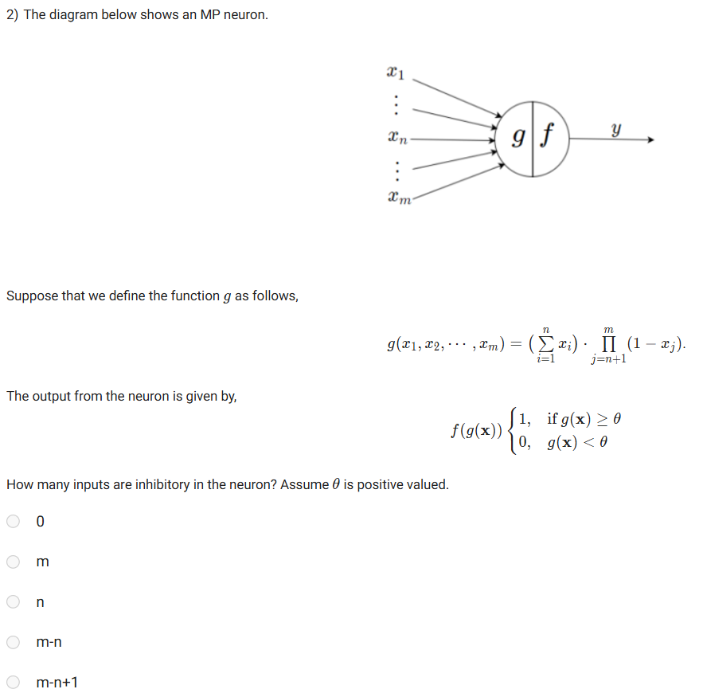

## Answer: m - n

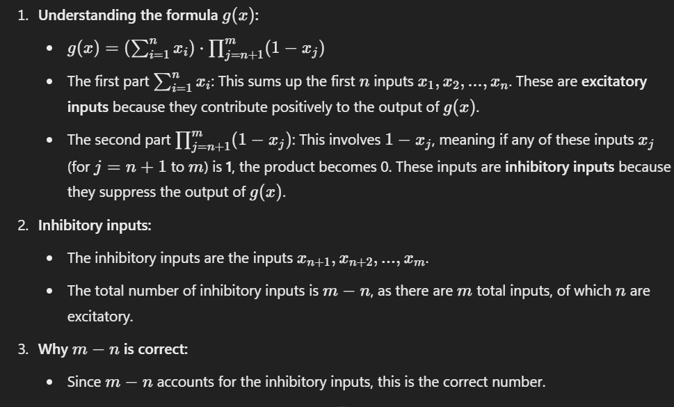

# Question 3:

3. The diagram below shows an implementation of a Boolean function using three logical AND gates. What is the minimum number of MP neurons required to implement the same Boolean function? Assume that all inputs are excitatory.

    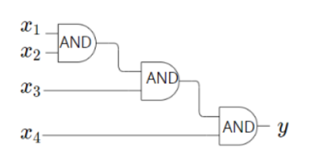

    - 3
    - 2
    - 1
    - 4

## Answer: 1

- The given circuit performs the logical AND operation across four inputs (x1, x2, x3, x4) step-by-step using three AND gates. 

- However, this can be implemented directly using a single MP neuron with the following configuration:

    - Weights and Threshold:
        - Assign a weight of 1 to each input (x1, x2, x3, x4)
        - Set the threshold (θ) of the neuron to 4.

    - Logic of the MP Neuron:
        - The MP neuron sums up the inputs: g(x) = (x1, x2, x3, x4)
        - If all inputs (x1, x2, x3, x4) are 1, the sum becomes 4, which satisfies the threshold condition g(x)≥θ.
        - If any input is 0, the sum becomes less than 4, and the output will be 0.

    - Why only 1 neuron is sufficient:
        - The circuit represents a logical AND operation across all inputs. 
        - Since an MP neuron can compute the AND operation for multiple inputs directly with appropriate weights and a threshold, only 1 neuron is needed.

# Question 4: 

4. We know that a Boolean function maps {0,1}^n → {0,1}. How many Boolean functions are there when n = 0? Assume that the function allows an empty element as an input.

## Answer: 2

- When n=0, the input set {0,1}^0 contains only one element: the empty tuple. 

- This is because the Cartesian product of zero sets results in a single empty set.

- For this single input (the empty tuple), the Boolean function can map it to either 0 or 1. 

- Therefore, there are 2 possible Boolean functions when n=0.

# Question 5: 

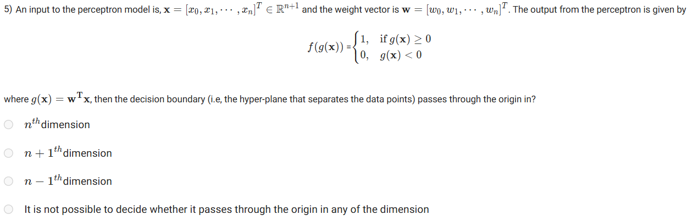

## Answer: n + 1

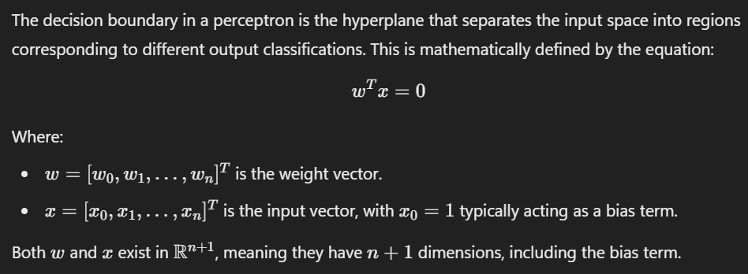

# Question 6:

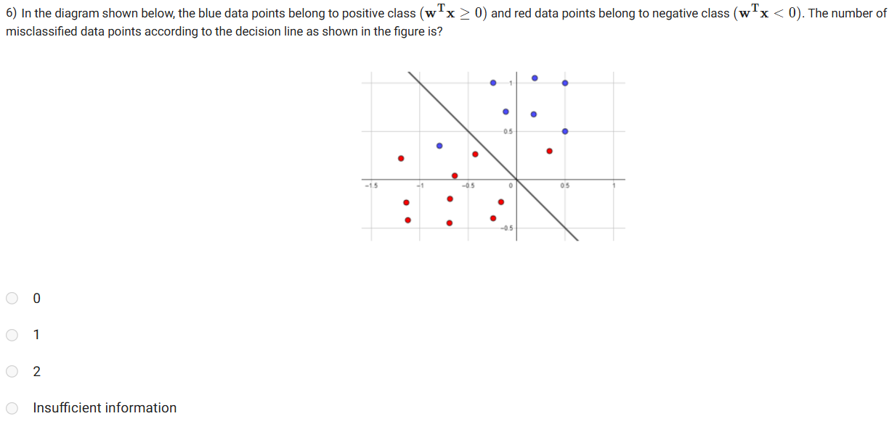

## Answer: Insufficient information

- The positive and negative sides of the decision boundary are not explicitly labeled or defined in the figure, which makes it impossible to accurately determine the classification of all data points.

# Question 7: 

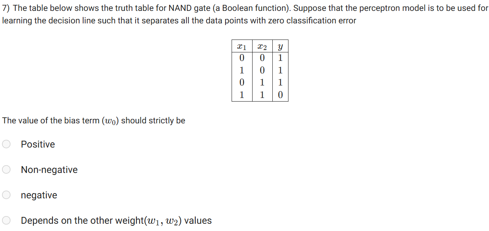

## Answer: Positive

- In the perceptron model for the NAND gate:

  - The output y=1 for inputs (0, 0), (1, 0), (0, 1) and y=0 for input (1, 1).

  - To correctly classify (0,0) with y=1, the bias w0 alone must be positive because no contributions come from x1 and x2 (both are 0).

  - For input (1,1), where y=0, the perceptron ensures the condition w0 + w1 + w2 < 0 which is influenced by the weights w1 and w2. Here, the bias w0 can remain positive as long as w1+w2 is sufficiently negative to satisfy the inequality.

- Thus, w0 must be strictly positive to correctly separate the data points without any classification error.

# DATA FOR Q8-10:

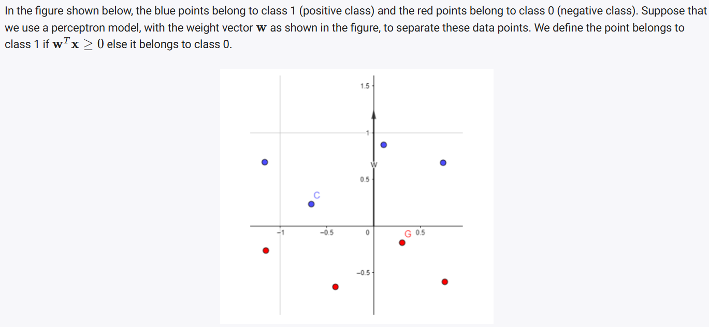

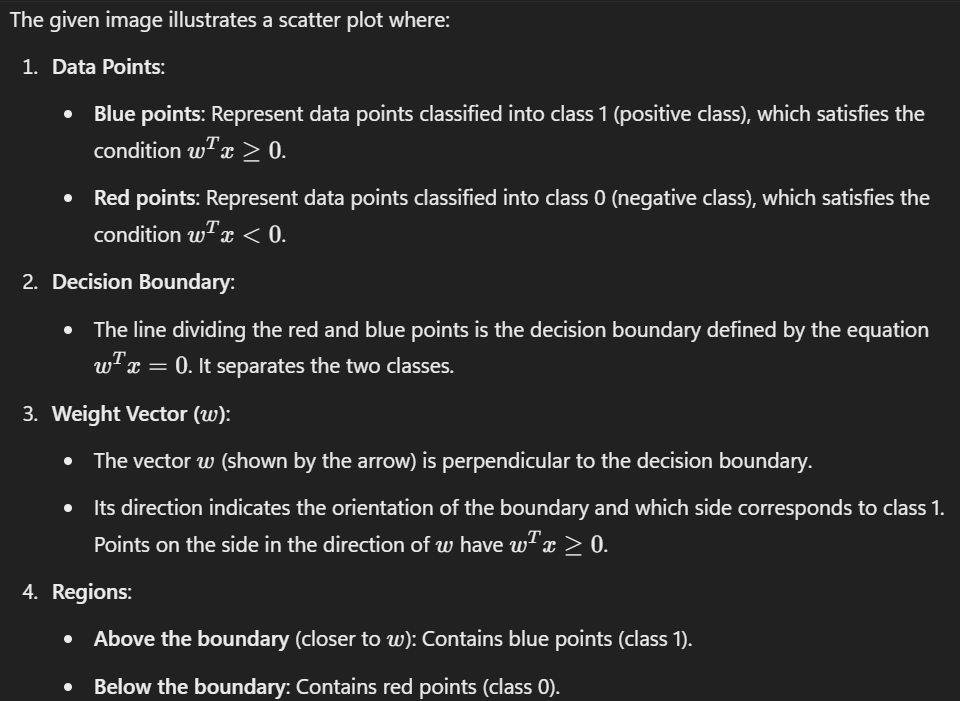

# Question 8: (Doubt)

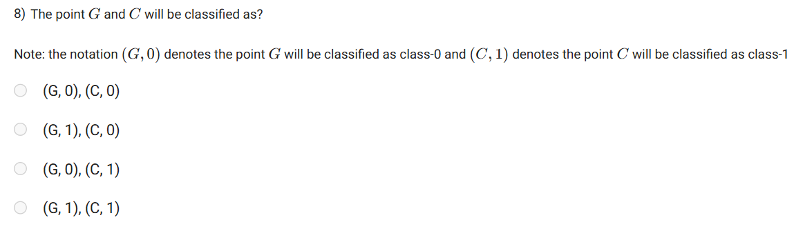

## Answer: (G, 0), (C, 1)

- In the given diagram:

  - The point C (blue point) lies above the decision boundary, which corresponds to the positive class (class 1) because it satisfies the condition wTx≥0.

  - The point G (red point) lies below the decision boundary, which corresponds to the negative class (class 0) because it satisfies the condition wTx<0.

- Thus:

  - Point G will be classified as class 0 (denoted as (G, 0)).
  - Point C will be classified as class 1 (denoted as (C, 0)).

# Question 9: 

9. The statement that “there exists more than one decision lines that could separate these data points with zero error ” is,

## Answer: True

- Since the data in the example is linearly separable, it is indeed possible to have more than one decision line that can separate the classes without error.

# Question 10:

10. Suppose that we multiply the weight vector w by -1. Then the same points G and C will be classified as?

## Answer: (G, 1), (C, 0)

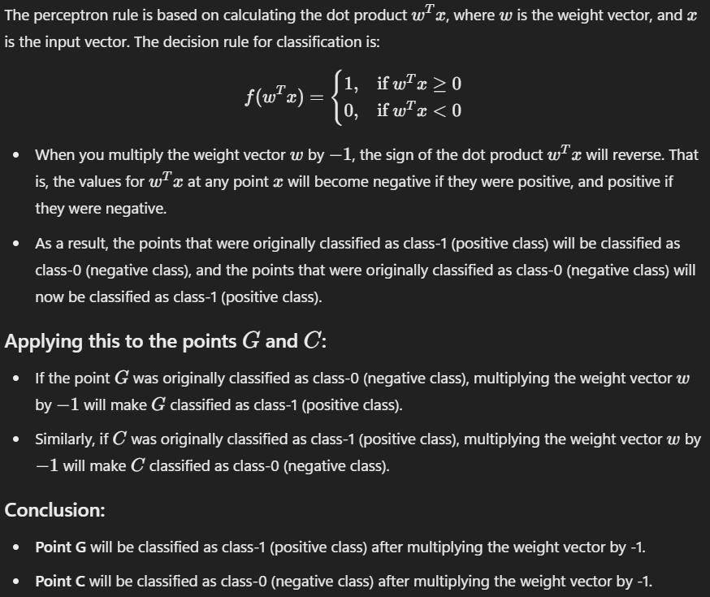