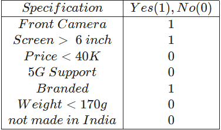
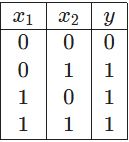
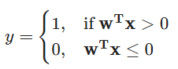
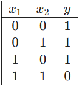

# Question 1:

1. Which of the following components of a biological neuron is primarily responsible for processing information received from other neurons in the brain?

    - Dendrites
    - Soma
    - Axon
    - Synapses

## Answer: Soma

- The soma (cell body) of a biological neuron is primarily responsible for processing the information received from dendrites. 

- It integrates the incoming signals and generates an output if the combined signal surpasses a threshold.

## Why other options are incorrect:

- Dendrites: Dendrites are responsible for receiving information from other neurons, not processing it.

- Axon: The axon transmits the processed signal from the soma to other neurons or target cells.

- Synapses: Synapses are the points of connection where communication occurs between neurons. They facilitate the transmission of signals, but they do not process the information.

# Question 2:

2. Suppose that the MP neuron model is used to predict whether a particular user will buy a smartphone (y=1) or not (y=0). Suppose further that the user looks for a set of specifications listed below. The user buys the phone at least if any two of his/her specifications are present, and rejects the phone (despite the other specifications) if it is not made in India. What is the suitable threshold (θ) value so that the user buys the phone?
    - 1
    - 0
    - 2
    - 3
    - 4

## Answer: 2

- The user buys the phone if at least two of the specifications match their preferences and the phone is made in India. 

- Since the user rejects the phone if it is not made in India (independent of other preferences), the threshold θ must account for these rules:

    1. The two specifications rule means the MP neuron needs a threshold of 2 for the output y=1 (buy).

    2. The phone must also satisfy the condition "made in India", which is handled by the specification not made in India (value = 0).

- Thus, θ=2 ensures that the model accounts for at least two preferences being satisfied.

## Why other options are incorrect:

- 1: A threshold of 1 would predict y=1 even if only one specification is satisfied, which violates the "at least two specifications" rule.

- 0: A threshold of 0 would predict y=1 regardless of specifications, which is incorrect.

- 3: A threshold of 3 would incorrectly reject phones where exactly two specifications are satisfied, even though this is enough for the user to buy the phone.

- 4: A threshold of 4 would make it impossible for the user to buy the phone, as there are not enough satisfied specifications to meet this value.

# Question 3:

2. In question 2, Which of the specifications listed in the table is an inhibitory input to the MP neuron?

    - Price
    - 5G support
    - not made in India
    - None of those

## Answer: not made in India

- In the MP neuron model, an inhibitory input is one that prevents the output from being y=1 (buy), regardless of the other inputs. 

- The specification "not made in India" directly causes the phone to be rejected (y=0), even if all other specifications match the user's preferences.

## Why other options are incorrect:

- Price: 
    - The value of this feature does not prevent the user from buying the phone; it only contributes to the decision if other conditions are met.
- 5G support: 
    - Similar to "Price," this feature is not inhibitory; it merely adds to the overall decision process.
- None of those: 
    - This is incorrect because "not made in India" explicitly acts as an inhibitory input in the given scenario.

# Question 4:

4. The statement that all Boolean functions can’t be implemented only using excitatory inputs is

    - True for non-linearly separable Boolean functions
    - True for some Boolean functions independent of whether they are linearly separable or not
    - False, all Boolean functions can be implemented without using inhibitory inputs

## Answer: True for some Boolean functions independent of whether they are linearly separable or not

- Some Boolean functions, whether linearly separable (e.g., AND, OR) or not (e.g., XOR), may require inhibitory inputs depending on how the neuron model is designed. 

- This is because the behavior of the model isn't solely determined by linear separability but also by the constraints imposed on excitatory or inhibitory inputs.

## Why other options are incorrect:

- True for non-linearly separable Boolean functions: 
    - This restricts the scope unnecessarily to non-linearly separable functions like XOR, overlooking that certain linearly separable functions might also depend on inhibitory inputs in specific cases.
- False, all Boolean functions can be implemented without using inhibitory inputs:     
    - This is outright incorrect, as there are Boolean functions that inherently require inhibitory inputs to implement the logic.

# Question 5: 

5. Suppose that we represent inputs x ∈ {0,1}^6
  of a Boolean function as vertices of a hypercube in 6-dimensional space. Then the hyperplane defined by x1 + x2 + x3 + x4 + x5 + x6 = 0
only touches which of the following inputs?

    - (0,0,0,0,1,0)
    - (0,0,0,0,0,1)
    - (0,1,1,0,0,1)
    - (0,0,0,0,0,0)

## Answer: (0,0,0,0,0,0)

- The hyperplane equation specifies that the sum of all components of the input vector (x1, x2, . . . , x6) must equal 0. 

- For any vertex (x1, x2, . . . , x6), since xi ∈ {0,1}, the sum of these components can only be 0,1,2,…,6.

    - If the sum equals 0, all xi's must be 0.
    - For all other inputs, the sum will be greater than 0, and thus the hyperplane will not "touch" these points.

## Checking the options:

- (0,0,0,0,1,0): The sum is 1, not 0.
- (0,0,0,0,0,1): The sum is 1, not 0.
- (0,1,1,0,0,1): The sum is 3, not 0.
- (0,0,0,0,0,0): The sum is 0, so this is the only point that satisfies the hyperplane equation.

# Question 6: 

6. We know that a Boolean function maps {0,1}^n → {0,1}. How many linearly separable functions are there when n=1?

    - 0
    - 1
    - 2
    - 4

## Answer: 4

### Step 1: Understanding the problem

- When n=1, the input x∈{0,1} has only two possible values: 
    - x=0 and x=1

- The output of the Boolean function can also be 0 or 1. Thus, we can create 4 total Boolean functions, each mapping the two inputs to outputs.

### Step 2: Listing the functions

- The 4 possible functions for n=1 are:

    - f(0)=0,f(1)=0 (constant 0)
    - f(0)=0,f(1)=1 (identity)
    - f(0)=1,f(1)=0 (negation)
    - f(0)=1,f(1)=1 (constant 1)

### Step 3: Checking linear separability

- A Boolean function is linearly separable if its outputs can be separated by a hyperplane in the input space. 

- All four functions are linearly separable because:

    - Function 1 (constant 0): Output is always 0, trivially separable.
    - Function 2 (identity): A threshold of x>0 separates 0 from 1.
    - Function 3 (negation): A threshold of x<1 separates 1 from 0.
    - Function 4 (constant 1): Output is always 1, trivially separable.

# Question 7:

7. We know from the lecture that the decision boundary learned by the perceptron is a line in r^2. We also observed that it divides the entire space of R^2 into two regions, suppose that the input vector x∈R^5, then the perceptron decision boundary will divide the whole R^5 space into how many regions?
    - 2
    - 3
    - 5
    - 4
    - It depends on whether the data points are linearly separable or not

## Answer: 2

- In R^5, the decision boundary is a 4-dimensional hyperplane. 

- A hyperplane always divides the space into two regions: one on each side of the hyperplane.

- No matter how many dimensions the space has, the hyperplane will still divide it into two parts.

- So, for R^ 5, the perceptron decision boundary will divide the space into 2 regions.

# Question 8:

8. Consider the following table, where x1 and x2 are features (packed into a single vector x=[x1 x2] and y is a label,

    .
Suppose that the perceptron model is used to classify the data points. Suppose further that the weights w are initialized to w = [1 1]
The following rule is used for classification,

The perceptron learning algorithm is used to update the weight vector w. Then, how many times the weight vector w will get updated during the entire training process?

## Answer: 0

- We will run through the training steps and apply the perceptron update rule to track the number of updates.

### Step 1: Initialize weights

- The weights are initialized to w=[1,1].

### Step 2: Training Process (Perceptron Learning)

- We will go through the data points one by one and check if the perceptron correctly classifies the point. If not, we update the weights.

    - First data point [0,0], label y=0:
        - wTx=[1,1]⋅[0,0]=0
        - Since wTx≤0, the predicted label is 0, which matches the true label. No update.
    - Second data point [0,1], label y=1:
        - wTx=[1,1]⋅[0,1]=1
        - Since wTx>0, the predicted label is 1, which matches the true label. No update.
    - Third data point [1,0], label y=1:
        - wTx=[1,1]⋅[1,0]=1
        - Since wTx>0, the predicted label is 1, which matches the true label. No update.
    - Fourth data point [1,1], label y=1:
        - wTx=[1,1]⋅[1,1]=1
        - Since wTx>0, the predicted label is 2, which matches the true label. No update.

- The perceptron correctly classifies all the data points without any misclassification. 

- Therefore, the weight vector w will not be updated at all during the training process.

# Question 9: 

9. Consider the following table, where x1 and x2 are features and y is a label

    

    Assume that the elements in 
w
w are initialized to zero and perceptron learning algorithm is used to update the weights w. If the learning algorithm runs for long enough iterations, then

- The algorithm converges (i.e., no further weight updates) after some iterations
- The algorithm never converge
- The classification error becomes zero eventually
- The classification error remains greater than zero

## Answers: 

### The algorithm converges (i.e., no further weight updates) after some iterations.

### The classification error becomes zero eventually.

- The perceptron is initialized with weights w=[0,0]. 

- The perceptron learning algorithm is used to update the weights based on misclassifications. 

- Since the dataset is linearly separable, the perceptron will eventually converge.

### Perceptron Convergence:

- Linearly separable data: 
    - For linearly separable datasets, the perceptron learning algorithm guarantees convergence after a finite number of updates.
- Since the data can be separated by a hyperplane, the perceptron will eventually learn the correct weights and stop making further updates once it correctly classifies all data points.

- Thus, the algorithm will converge (i.e., no further weight updates) after some iterations, and the classification error will become zero eventually.

# Question 10:

10. The statement that “In perceptron model, the weight vector w is always orthogonal to the linear decision boundary” is
    - True
    - False

## Answer: True

- This orthogonality means that w is always perpendicular to the decision boundary, determining the orientation of the hyperplane in the feature space.